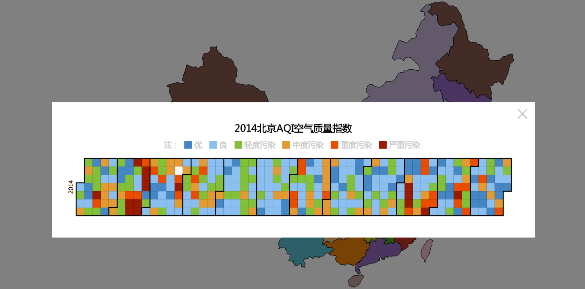
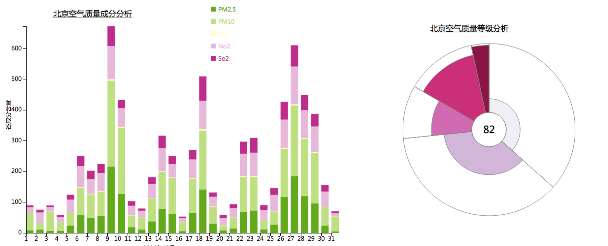
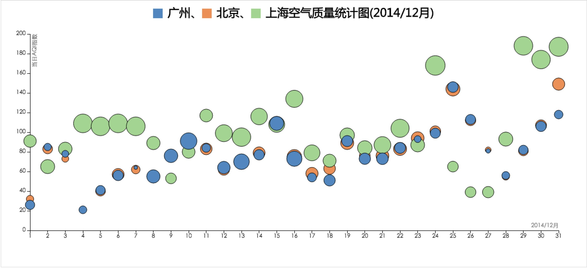
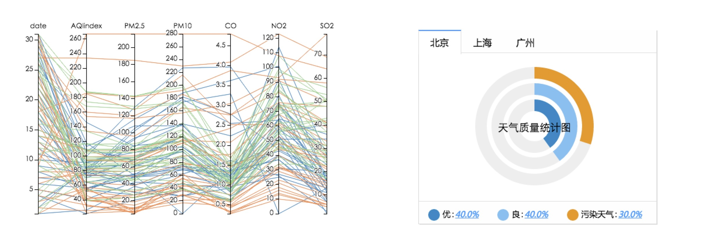

2014年部分地区空气质量指数可视化数据分析展示
=====================

页面展示

###first

- 上（地图＋日历图）：2014年每天的AQI均值统计图；
    `从上到下依次是星期1-7;`
    `从左往右依次是1-12个月；`
    `不同颜色代表其污染程度;`
- 下左（堆叠柱状图）：2014年12月份每天空气质量成分分析图；
- 下右（南丁格尔图）：2014年12月份空气质量等级统计图
    `不同颜色：污染程度，颜色越深，污染越严重；`
    `中间值：月AQI均值;`
    `弧度表：AQI范围的天数;`
    `半径：同一污染程度的均值;`

###second

- 上（气泡图）：2014年12月份广州、北京、上海空气质量统计图；
    `颜色：不同地区;`
    `高度：当天AQI的值;`
    `半径：SQ2的含量;`
- 下左（平行坐标图）：2014年12月份每天空气质量成分分析图；
    `每天AQI的各数据成分;`
    `拖拽提供筛选各成分的功能;`
- 下右（饼图）：2014年12月份各地区空气质量等级统计图;
    `Tab切换不同城市;`
    `0-50：优51-100: 良;`
    `100以上：为污染天气;`

